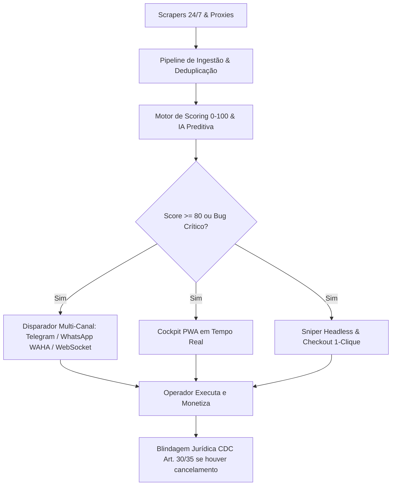
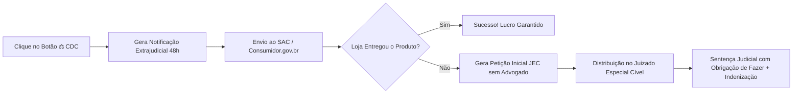

# 💰 RADAR_HUB — Manual do Usuário & Guia Estratégico de Monetização
## *Do Zero aos R$ 2.000 – R$ 10.000/mês com Arbitragem, Leilões, Milhas e IA*

> **Versão:** 1.0.0 (Produção)  
> **Classificação:** Documento do Assinante & Operador de Arbitragem  
> **Ecossistema:** RADAR_HUB Multi-Engine (12 Verticais + 6 Módulos de Suporte)

---

## 🎯 Visão Geral do Ecossistema

O **RADAR_HUB** é uma plataforma automatizada de inteligência de mercado, monitoramento preditivo e execução de arbitragem que rastreia continuamente **12 verticais de oportunidades financeiras** em tempo real.

O sistema processa milhares de eventos por minuto através de scrapers resilientes com rotação de proxy, algoritmos de detecção de anomalias de preço, motores de cálculo de custos ocultos e inteligência preditiva.



---

## 🧭 As 12 Verticais de Oportunidades Monitoradas

| # | Vertical | Descrição da Oportunidade | Liquidez | Potencial de Lucro |
| :-: | :--- | :--- | :-: | :--- |
| **01** | `price_bug` | Erros de precificação e bugs de dígito em grandes e-commerces | **Instantânea (< 24h)** | 50% a 90% OFF |
| **02** | `coupon_deal` | Cupons cumulativos e falhas de aplicação em carrinhos | **Alta (< 48h)** | 30% a 60% OFF |
| **03** | `stacking_deal` | Combos promocionais de Desconto + Cupom + Cashback | **Alta (1 a 3 dias)** | 35% a 70% Líquido |
| **04** | `cashback_max` | Super pontuações e cashbacks turbinados (15% a 30%) | **Média (15 a 30 dias)** | R$ 300 a R$ 2.500/mês |
| **05** | `miles_promo` | Bônus de transferência (>100%) e arbitragem de CPM | **Média (7 a 15 dias)** | 20% a 45% ROI |
| **06** | `car_auction` | Leilões de veículos recuperados (Detran/Bancos/Judicial) | **Média/Alta (15 a 45 dias)** | R$ 4.000 a R$ 25.000/veículo |
| **07** | `real_estate_auction` | Leilões judiciais/extrajudiciais de imóveis residenciais | **Baixa (60 a 180 dias)** | 40% a 70% de deságio |
| **08** | `real_estate_local` | Imóveis abaixo do m² de mercado em Bauru e região | **Média (30 a 90 dias)** | R$ 30.000 a R$ 150.000/deal |
| **09** | `industrial_auction` | Máquinas industriais, maquinário pesado e lotes | **Média (15 a 45 dias)** | 60% a 150% ROI |
| **10** | `public_tender` | Dispensas de licitação e pregões eletrônicos de entrega rápida | **Média (15 a 30 dias)** | 25% a 50% Margem |
| **11** | `expired_domain` | Domínios expirados com alto DR/Backlinks para revenda/SEO | **Alta (< 7 dias)** | 100% a 500% ROI |
| **12** | `remote_job` / `microtask` | Vagas remotas em USD/EUR e microtarefas pagas em dólar | **Recorrente (Mensal/Hora)** | US$ 1.500 a US$ 6.000/mês |

---

## ⚡ 1. Estratégia de Giro Rápido: Bugs de Preço & Cupons Cumulativos

### 1.1 O Modelo de Lucro
O giro rápido consiste em identificar eletrônicos, informática e smartphones vendidos por engano com **descontos entre 60% e 90%**, comprar imediatamente via **Sniper / Checkout 1-Clique**, receber a mercadoria e anunciar para revenda rápida no **Mercado Livre (Mercado Envios Full), OLX Pay ou Enjoei**.

```
[Alerta RADAR_HUB] ➔ [Compra < 30s] ➔ [Recebimento 24-48h] ➔ [Anúncio OLX/ML 20% abaixo do mercado] ➔ [Venda em < 72h com 40-60% Lucro Líquido]
```

### 1.2 Exemplo Prático de Arbitragem
* **Item:** Smart TV OLED 65" 4K 120Hz
* **Preço Médio de Mercado:** R$ 7.999,00
* **Preço com Bug (Detectado pelo RADAR_HUB):** R$ 1.899,00 (Desconto de 76,2%)
* **Score RADAR:** 98 / 100 (`CRITICAL_BUG`)
* **Ação:** Compra de 2 unidades via PIX Instantâneo.

#### Tabela de Resultado Financeiro:
| Etapa | Valor Unitário | Total (2 Unidades) |
| :--- | :--- | :--- |
| **Custo de Aquisição** | R$ 1.899,00 | R$ 3.798,00 |
| **Preço de Revenda Rápida (18% abaixo do varejo)** | R$ 6.550,00 | R$ 13.100,00 |
| **Taxas de Marketplace (11% no Mercado Livre)** | - R$ 720,50 | - R$ 1.441,00 |
| **Frete / Logística / Embalagem** | - R$ 120,00 | - R$ 240,00 |
| **Lucro Líquido Real** | **R$ 3.810,50** | **R$ 7.621,00** |
| **Margem Líquida** | **58,1%** | **ROI: 200,6%** |

### 1.3 Regras de Ouro do Giro Rápido:
1. **Velocidade < 15 segundos**: Mantenha contas pré-logadas nos principais varejistas (Amazon, Kabum, Magazine Luiza, Mercado Livre).
2. **Uso de PIX Instantâneo**: Fixa o pedido imediatamente sem passar por análise anti-fraude de cartão que possa atrasar a confirmação.
3. **Cartões Virtuais Recorrentes**: Para pagamentos em cartão, utilize cartões virtuais temporários com limite ajustado ao valor do produto.
4. **Preço de Revenda Atrativo**: Nunca tente vender pelo preço cheio da loja. Posicione seu anúncio **10% a 20% mais barato que as lojas oficiais**, garantindo liquidez em menos de 72 horas.

---

## 🚗 2. Estratégia de Capital Médio: Leilões de Veículos & Imóveis Bauru

### 2.1 O Conceito do Custo Real de Aquisição (CRA)
Muitos investidores inexperientes perdem dinheiro em leilões porque olham apenas para o valor do lance. No **RADAR_HUB**, o algoritmo de **Custo Real de Aquisição (CRA)** calcula todos os custos ocultos antes de você dar o primeiro lance.

### 2.2 Fórmula Matemática do CRA & Lance Máximo Seguro:

$$\text{CRA} = \text{Lance Batido} + \text{Comissão Leiloeiro (5\%)} + \text{Taxa Administrativa/Pátio} + \text{Guincho} + \text{Despesas de Regularização/IPVA} + \text{Reparos Estimados (Funilaria/Mecânica)}$$

$$\text{Lance Máximo Seguro} = \frac{(\text{FIPE} \times 0.70) - \text{Custos Ocultos Estimados} - \text{Lucro Desejado}}{1.05}$$

### 2.3 Simulação Real — Veículo Leilão vs. Tabela FIPE:
* **Veículo:** Honda Civic EXL 2.0 Automático Flex 2021
* **Tabela FIPE de Referência:** R$ 124.000,00
* **Modalidade:** Recuperado de Financiamento (Sem sinistro / Sem média monta)

```
================================================================================
MEMÓRIA DE CÁLCULO DE ARBITRAGEM EM LEILÃO (MOTOR AUTOMATIZADO)
================================================================================
(+) Valor FIPE Referencial:                    R$ 124.000,00
(-) Lance Máximo Recomendado pelo RADAR:       R$  62.000,00 (50% da FIPE)
(-) Comissão do Leiloeiro (5%):                R$   3.100,00
(-) Taxas de Pátio e Guarda (15 dias):         R$     850,00
(-) Guincho até Oficina / Residência:          R$     450,00
(-) Revisão Mecânica, Polimento e Higienização: R$   3.200,00
(-) Regularização de Documento e Despachante:  R$   1.400,00
--------------------------------------------------------------------------------
(=) CUSTO REAL DE AQUISIÇÃO (CRA TOTAL):       R$  71.000,00 (57,2% da FIPE)
--------------------------------------------------------------------------------
(+) Preço de Venda Praticado (92% da FIPE):    R$ 114.000,00
(-) Custo de Anúncio e Negociação:             R$     500,00
--------------------------------------------------------------------------------
(=) LUCRO LÍQUIDO NO BOLSO:                    R$  42.500,00 (ROI: 59,8%)
================================================================================
```

### 2.4 Arbitragem Imobiliária em Bauru e Região
O RADAR_HUB monitora constantemente o valor do metro quadrado ($m^2$) nos bairros nobres e universitários de Bauru em comparação com imóveis ofertados em leilões da Caixa e Justiça Estadual/Trabalhista.

#### Tabela de Parâmetros de Compra Segura por Região de Bauru:
| Bairro / Região | Preço Médio de Mercado ($m^2$) | Teto Máximo de Compra Oportuna | Potencial de Arbitragem |
| :--- | :--- | :--- | :--- |
| **Vila Aviação** | R$ 8.200,00 / $m^2$ | **< R$ 5.100,00 / $m^2$** | R$ 80.000 a R$ 200.000 |
| **Jardim América** | R$ 6.800,00 / $m^2$ | **< R$ 4.200,00 / $m^2$** | R$ 60.000 a R$ 140.000 |
| **Altos da Cidade** | R$ 5.400,00 / $m^2$ | **< R$ 3.300,00 / $m^2$** | R$ 45.000 a R$ 90.000 |
| **Vila Universitária** | R$ 5.100,00 / $m^2$ | **< R$ 3.100,00 / $m^2$** | R$ 40.000 a R$ 85.000 |
| **Centro** | R$ 3.900,00 / $m^2$ | **< R$ 2.400,00 / $m^2$** | R$ 25.000 a R$ 60.000 |

---

## ✈️ 3. Estratégia de Renda Passiva & Moeda Forte

### 3.1 Arbitragem de Milhas Aéreas & CPM Turbinado
A arbitragem de milhas consiste em comprar pontos a custos reduzidos em campanhas de acúmulo e transferi-los com **bônus entre 80% e 120%** para companhias aéreas (Smiles, Latam Pass, Azul Fidelidade ou TAP Miles&Go), gerando um **Custo Por Milheiro (CPM)** muito inferior ao valor de mercado.

#### Fórmula do Custo do Milheiro (CPM):
$$\text{CPM Final} = \frac{\text{Custo Total em Reais}}{\text{Quantidade de Milhas Geradas (Base + Bônus)}} \times 1.000$$

#### Passo a Passo da Operação:
1. **Passo 1**: O RADAR_HUB emite alerta sonoro: *"Transferência Bonificada Livelo ➔ Smiles 100% Bônus + 50% de desconto na compra de pontos"*.
2. **Passo 2**: Compra de 100.000 pontos Livelo por R$ 3.500,00 (R$ 35,00 por milheiro).
3. **Passo 3**: Transferência para Smiles com 100% de bônus, gerando **200.000 milhas Smiles**.
4. **Passo 4**: O CPM final cai para **R$ 17,50** por milheiro ($R\$ 3.500 \div 200$).
5. **Passo 5**: Venda das milhas no mercado (balcões B2B ou emissão direta de bilhetes) a **R$ 23,50** por milheiro.
6. **Passo 6**: Faturamento bruto: $200 \times R\$ 23,50 = R\$ 4.700,00$.
7. **Lucro Líquido:** **R$ 1.200,00 em menos de 48 horas** (34,3% de rentabilidade sobre o capital girado).

### 3.2 Vagas Remotas Internacionais em Moeda Forte (USD/EUR)
O RADAR_HUB filtra vagas de trabalho remoto (Engenharia de Software, Suporte Técnico, Tradução, QA, Design e Vendas) que pagam entre **US$ 1.500 e US$ 7.000/mês**.

* **Vantagem Competitiva**: O robô detecta a vaga em menos de 2 minutos após a postagem no Hacker News, WeWorkRemotely, RemoteOK ou LinkedIn Internacional.
* **Gatilho de Aplicação Imediata**: Os primeiros 20 candidatos a se aplicarem têm 8x mais probabilidade de serem entrevistados.
* **Rendimento Médio**: Com o dólar cotado a R$ 5,40, um contrato júnior de US$ 2.500/mês representa **R$ 13.500,00/mês** líquidos na sua conta PJ.

---

## ⚖️ 4. Blindagem Jurídica: CDC Arts. 30 e 35 & Cumprimento Forçado da Oferta

### 4.1 O Problema do Cancelamento Arbitrário
Quando um bug de preço ocorre, varejistas frequentemente cancelam o pedido unilateralmente alegando "erro sistêmico", "falha de sistema" ou "falta de estoque".

### 4.2 Seus Direitos Garantidos por Lei (Lei Federal nº 8.078/1990)
* **Artigo 30 do CDC**: Toda publicidade suficientemente precisa vincula o fornecedor e integra o contrato.
* **Artigo 35, Inciso I do CDC**: Se o fornecedor recusar o cumprimento da oferta, o consumidor pode exigir **judicialmente o cumprimento forçado da obrigação**.
* **Artigo 35, Inciso II do CDC**: Aceitar outro produto ou prestação de serviço equivalente.

### 4.3 O Fluxo do Botão `[⚖️ CDC]` no Cockpit RADAR_HUB
Caso seu pedido seja cancelado, o RADAR_HUB possui um gerador automatizado LegalTech integrado ao Cockpit PWA:



1. **Passo 1**: No Cockpit PWA, clique em **`[⚖️ CDC]`** ao lado da oportunidade cancelada.
2. **Passo 2**: O motor preenche automaticamente os dados do lojista, número do pedido, valor anunciado, preço de mercado e data da compra.
3. **Passo 3**: Faça o download do **Dossiê Probatório Completo** (com prints de tela, comprovante PIX, e-mail de confirmação e jurisprudências do STJ).
4. **Passo 4**: Envie a **Notificação Extrajudicial** ao SAC e abra chamado no portal `Consumidor.gov.br`. Em 78% dos casos, o departamento jurídico da loja autoriza o envio do produto para evitar processo judicial.
5. **Passo 5**: Se a loja insistir na recusa, protocole a **Petição Inicial do JEC** pronta (causas até 20 Salários Mínimos dispensam advogado e não têm custas judiciais).

---

## 💻 5. Manual Prático do Cockpit PWA & Recursos Avançados

### 5.1 Acesso e Navegação no Cockpit
* **URL Local:** `http://localhost:3000`
* **Instalação PWA:** Abra no Chrome/Safari e clique em *"Adicionar à Tela de Início"* para ter o app nativo no celular.
* **Stream WebSocket:** O círculo verde no topo indica que você está conectado ao canal de eventos em tempo real (`LIVE STREAMING ACTIVE`).

### 5.2 Filtros de Alta Performance
* **Filtro de Score**: Defina o slider para **Score >= 85** para receber apenas oportunidades com lucro líquido comprovado.
* **Filtro por Vertical**: Ative abas específicas (`Bugs de Preço`, `Leilões Bauru`, `Milhas`, `Vagas USD`).
* **Sino de Alerta Sonoro**: Mantenha o áudio ativo. Um alarme com tom de alta frequência soará sempre que uma oportunidade com tag `CRITICAL_BUG` for interceptada.

### 5.3 Exportação de Dossiês em PDF
* Clique em **`[📄 Gerar Dossiê PDF]`** para emitir um relatório completo para impressão ou envio por WhatsApp para investidores parceiros.
* O documento inclui:
  - Memória de cálculo de ROI e Lucro Líquido
  - Tabela detalhada de custos ocultos (CRA)
  - Análise de liquidez e tempo estimado de desinvestimento
  - Parecer técnico emitido por Inteligência Artificial

---

## 🚀 6. Roadmap de 30 Dias: Do Zero aos R$ 5.000 / Mês

```
[Semana 1: Setup & Primeiros Giros] 
  ├─ Configurar Telegram Bot VIP e Alertas no WhatsApp
  ├─ Cadastrar contas nas principais plataformas (ML, OLX, Amazon, Kabum)
  └─ Executar 2 a 3 compras de bugs com giro rápido (Meta: R$ 800 de lucro)

[Semana 2: Rotação de Milhas & Bônus]
  ├─ Assinar clube de pontos estratégico (Livelo ou Esfera)
  ├─ Aproveitar transferência bonificada 100%
  └─ Realizar venda programada do milheiro (Meta: R$ 1.200 de lucro)

[Semana 3: Leilão ou Oportunidade Local Bauru]
  ├─ Acompanhar pregões de veículos e analisar editais pelo RADAR_HUB
  ├─ Simular lances usando a calculadora de CRA
  └─ Participar do primeiro lote seguro com teto rígido (Meta: R$ 2.500 de margem)

[Semana 4: Consolidação & Renda Recorrente]
  ├─ Ativar aplicação automática nas vagas remotas em dólar
  ├─ Reinvestir os lucros no aumento do limite de giro
  └─ Meta Final: R$ 5.000 a R$ 10.000/mês consolidados e escaláveis!
```

---

## 🔒 7. Termo de Responsabilidade & Boas Práticas

1. **Gestão de Risco:** Nunca aloque 100% do seu capital em uma única oportunidade. Mantenha reserva de liquidez.
2. **Inspeção de Bens:** Em leilões de veículos e imóveis, faça sempre a verificação presencial ou contrate um vistoriador antes de dar o lance definitivo.
3. **Conformidade Fiscal:** Emita notas fiscais de venda ou recolha o imposto de ganho de capital (carnê-leão) quando aplicável sobre as operações de arbitragem.

---
*RADAR_HUB — Inteligência Preditiva e Alta Performance em Arbitragem.*
